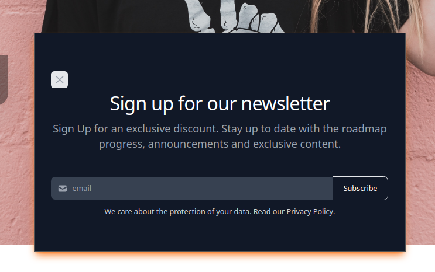
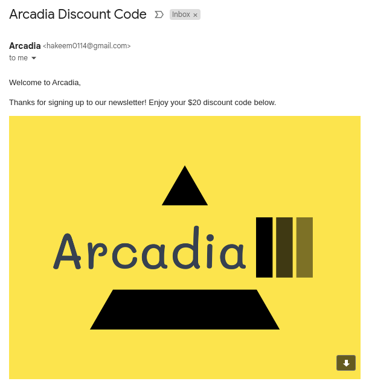
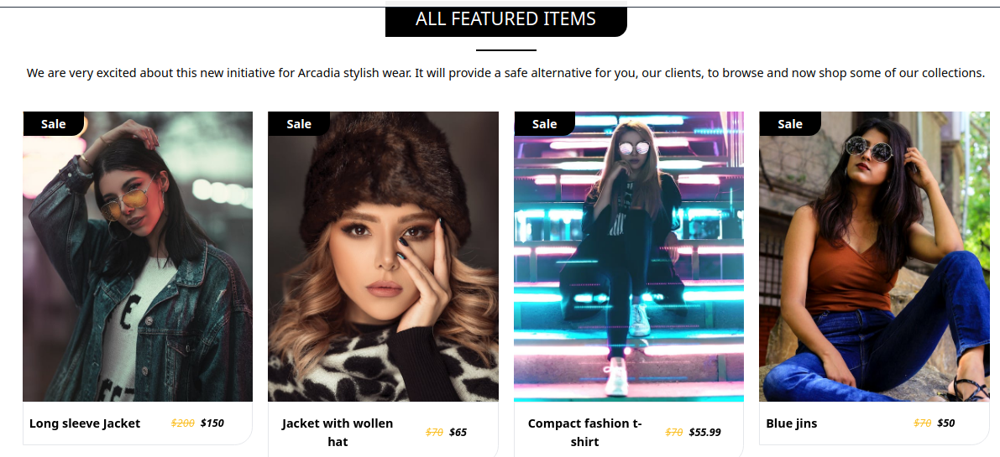
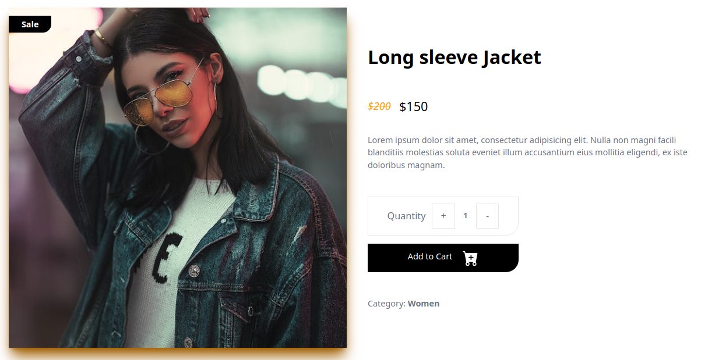
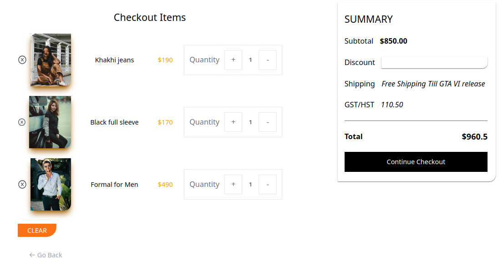
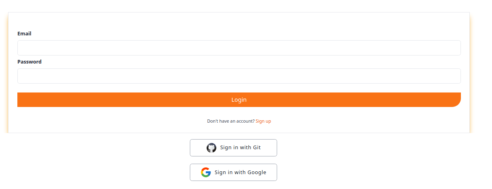

# Arcadia (Ecommerce Website)

A one-stop-shop for the stylish wear

## App Features


### Pop-up for Newsletter (React Modal)


```
  Pop-up to for newsletter. 
  Stops popping up after ~10 user visits or if they have already registered for it.
```

### Newsletter & Discount code


```
  Used email.js to send email, which icludes a one time $20 discount code per user.
  Collects emails in firebase (scalability)
```

### Cart & Stripe




```
  Product items with sale prices & categories.
  Payment through Stripe.
```

### User Authentication & Authorization


```
  Email, google & github login. Signout with firebase.
```


## Packages, Libraries, Techonolgies & APIs Used
Icons
```
    React Icons, icon8 & heroIcons
```

Routing
```
React router
```

APIs
```
Fake store API for json products. Axios for handling http requests from node.js 
```

State management
```
Redux Tookit, Persist & Devtools.

Rather than setting up & connecting the state management and then praying that it works, redux devtools is as critical as the Postman & chrome devtools.

Persist to store cache (redux store payload-> states -> initialValues & action to mutate with action in reducers) on user's local storage. 
Keeps states on browser refresh on unencrypted async storage on React native's store
```

Notifications
```
React Toastify to handle notifications
```

Storage 
```
    Firebase to stores user info for authentication & authorization 
```

Payments
```
    Stripe to handle payments with auth in node.js.
```

## Main programs used

TailwindCss, React, Node, Express 


## Lessons Learned

Refactoring
```
  Did not account for all edge cases with the redux reducers as I added more features to the project like the discount, modals & tax.
  Had to revise the reducers & states multiple times. I always create flowcharts & a sketch mock-up of what I want my project to be 
  however, it would be best to compile all the resources online of all the features I want to implement before I begin.
  Would save me a lot more time.

```

Stripe
```
  When testing the server with simple http request with POSTMAN, it worked until I tried to make payments through the UI.
  I tried the in-build resource fetch API instead of axios, with a bearer & stripe token from the UI but it not work.
  Also solutions included specified the which domains could make requests to the server but that also failed. 

  I knew I was getting close to the solution when the error on chrome devtool went from 'Network error' to 'Network Refused'.
  This told be that it was a cors error, that made STRIPE to block the authorization. The solution was to explicitly allow
  domains to make requests '*' & a header for the 'POST' request. 

    //Force cors & stripe error
    res.header('Access-Control-Allow-Origin', '*');
    res.header('Access-Control-Allow-Headers', '*');
    res.header('Access-Control-Allow-Headers', 'POST');

```

## Run Locally

Clone the project. Add environment variable for STRIPE & public API keys for email.js

Client
```
  npm run dev
```

Client
```
  nodemon index.js
```

# Server
Deployed on Render

https://github.com/hakeem0114/Arcadia_server
